# Securing Applications with Docker Enterpise Edition Advanced

In this lab you will integrate Docker Enterpise Edition Advanced in to your development pipeline. You will build your application from a Dockerfile and push your image to the Docker Trusted Registry (DTR). DTR will scan your image for vulnerabilities so they can be fixed before your application is deployed. This helps you build more secure apps!


> **Difficulty**: Intermediate

> **Time**: Approximately 90 minutes

> **Tasks**:
>
> * [Prerequisites](#prerequisites)
> * [Introduction](#introduction)
> * [Task 1: Accessing PWD](#task1)
> * [Task 2: Create Secrets](#task2)
> * [Task 3: Deploy Docker Stack](#task3)
>   * [Task 3.1: Update Service](#task3.1)
> * [Task 4: Create DTR Repository](#task4)
>   * [Task 4.1: Enable Docker Image Scanning](#task4.1)
>   * [Task 4.2: Create Repositories](#task4.2)
>   * [Task 4.3: Create Promotion Policy](#task4.3)
> * [Task 5: Pull / Push Docker Image ](#task5)
>   * [Task 5.1: Pull Image](#task5.1)
>   * [Task 5.2: Tag Image](#task5.2)
>   * [Task 5.3: Push Image](#task5.2)
> * [Task 6: Bad Docker Image ](#task6)
> * [Task 7: Docker Content Trust ](#task7)
> * [Conclusion](#conclusion)

## Document conventions
When you encounter a phrase in between `<` and `>`  you are meant to substitute in a different value.
We are going to leverage the power of [Play With Docker](http://play-with-docker.com).

## <a name="abbreviations"></a>Abbreviations
The following abbreviations are used in this document:

* UCP = Universal Control Plane
* DTR = Docker Trusted Registry
* DCT = Docker Content Trust
* EE = Docker Enterprise Edition
* BOM = Bill of Materials
* CVE = Common Vulnerabilities and Exposures
* PWD = Play With Docker

## <a name="prerequisites"></a>Prerequisites
This lab requires an instance of Docker Enterprise Edition (EE). Docker Enterprise Edition includes Docker Universal Control Plane and Docker Trusted Registry. This lab provides Docker EE.

## Understanding the Play With Docker Interface

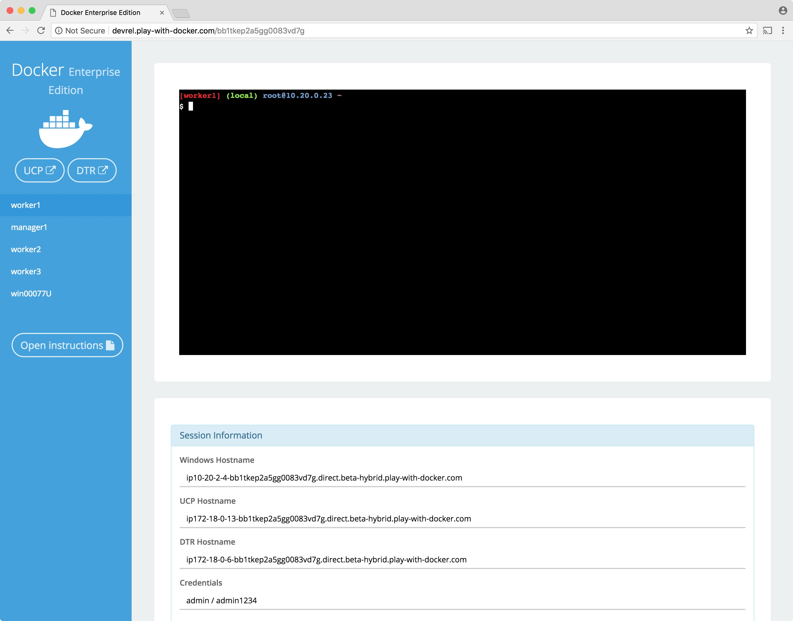

This workshop is only available to people in a pre-arranged workshop. That may happen through a [Docker Meetup](https://events.docker.com/chapters/), a conference workshop that is being led by someone who has made these arrangements, or special arrangements between Docker and your company. The workshop leader will provide you with the URL to a workshop environment that includes [Docker Enterprise Edition](https://www.docker.com/enterprise-edition). The environment will be based on [Play with Docker](https://labs.play-with-docker.com/).

If none of these apply to you, contact your local [Docker Meetup Chapter](https://events.docker.com/chapters/) and ask if there are any scheduled workshops. In the meantime, you may be interested in the labs available through the [Play with Docker Classroom](training.play-with-docker.com).

There are three main components to the Play With Docker (PWD) interface.

### 1. Console Access
Play with Docker provides access to the 3 Docker EE hosts in your Cluster. These machines are:

* A Linux-based Docker EE 18.01 Manager node
* Three Linux-based Docker EE 18.01 Worker nodes
* A Windows Server 2016-based Docker EE 17.06 Worker Node

> **Important Note: beta** Please note, as of now this is a beta Docker EE 2.0 environment. Docker EE 2.0 shows off the new Kubernetes functionality which is described below.

By clicking a name on the left, the console window will be connected to that node.

### 2. Access to your Universal Control Plane (UCP) and Docker Trusted Registry (DTR) servers
Additionally, the PWD screen provides you with a one-click access to the Universal Control Plane (UCP)
web-based management interface as well as the Docker Trusted Registry (DTR) web-based management interface. Clicking on either the `UCP` or `DTR` button will bring up the respective server web interface in a new tab.

### 3. Session Information
Throughout the lab you will be asked to provide either hostnames or login credentials that are unique to your environment. These are displayed for you at the bottom of the screen.

**Note:**  There are a limited number of lab connections available for the day. You can use the same session all day by simply keeping your browser connection to the PWD environment open between sessions. This will help us get as many people connected as possible, and prevent you needing to get new credentials and hostnames in every lab. However, if you do lose your connection between sessions simply go to the PWD URL again and you will be given a new session.

## <a name="introduction"></a> Introduction
This workshop is designed to demonstrate the power of Docker Secrets, Image Promotion, Scanning Engine, and Content Trust. We will walk through creating a few secrets. Deploying a stack that uses the secret. Then we will create a Docker Trusted Registry repository where we can create a promotion policy. The promotion policy leverages the output from Image Scanning result. This is the foundation of creating a Secure Supply Chain. You can read more about  secure supply chains for our [Secure Supply Chain reference architecture](https://success.docker.com/article/secure-supply-chain).

## <a name="task 1"></a>Task 1: Accessing PWD
1. Navigate in your web browser to the URL the workshop organizer provided to you.

2. Fill out the form, and click `submit`. You will then be redirected to the PWD environment.

	It may take a few minutes to provision out your PWD environment. After this step completes, you'll be ready to move on to task 1.2: Install a Windows worker node

## <a name="task2"></a>Task 2: Create Secrets
Secrets are new starting with Docker EE Engine 1.13 as well as Docker EE 17.03. A _secret_ is a blob of data such as a password, SSH private key, SSL certificate, or another piece of data that should not be transmitted over a network. Before UCP secrets were stored unencrypted in a Dockerfile or stored in your application's source code. With UCP Secrets we can now centrally manage and securely transmit it only to those containers that need access to it. Secrets follow a Least Privileged Distribution model and are encrypted at rest and in transit in a Docker swarm. A given secret is only accessible to those services which have been granted explicit access to it and only while those service tasks are running.

Secrets requires a swarm mode cluster. Use secrets to manage any sensitive data which a container needs at runtime but shouldn't be stored in the image or in source control such as:

- Usernames and passwords
- TLS certificates and keys
- SSH keys
- Other important data such as the name of a database or internal server
- Generic strings or binary content (up to 500 kb in size)

> **Note**: Docker secrets are only available to swarm services, not to standalone containers. To use this feature, consider adapting the container to run as a service with a scale of 1.

Another use case for using secrets is to provide a layer of abstraction between the container and a set of credentials. Consider a scenario where there have separate development, test, and production environments for an application. Each of these environments can have different credentials, stored in the development, test, and production swarms with the same secret name. The containers only need to know the name of the secret to function in all three environments.

When a secret is added to the swarm, Docker sends the secret to the swarm manager over a mutual TLS connection. The secret is stored in the Raft log, which is encrypted. The entire Raft log is replicated across the other managers, ensuring the same high availability guarantees for secrets as for the rest of the swarm management data.

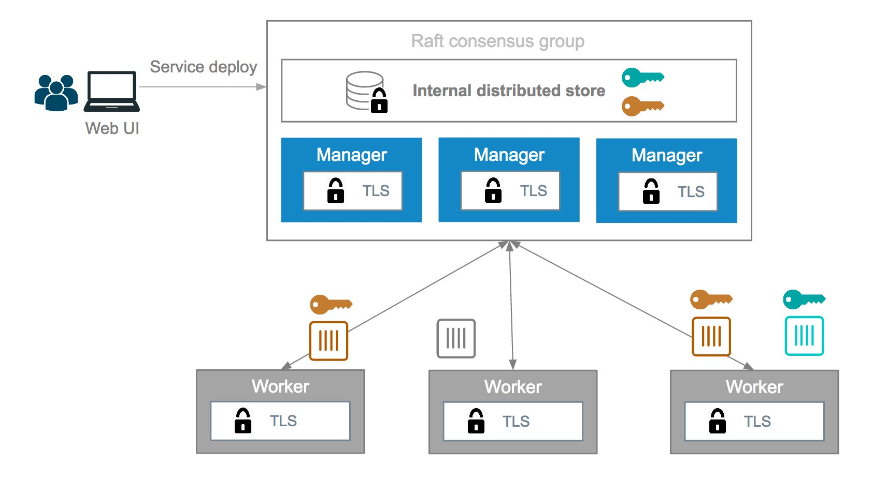

When a newly-created or running service is granted access to a secret, the decrypted secret is mounted into the container in an in-memory filesystem at `/run/secrets/<secret_name>`. It is possible to update a service to grant it access to additional secrets or revoke its access to a given secret at any time.

A node only has access to (encrypted) secrets if the node is a swarm manager or if it is running service tasks which have been granted access to the secret. When a container task stops running, the decrypted secrets shared to it are unmounted from the in-memory filesystem for that container and flushed from the node's memory.

If a node loses connectivity to the swarm while it is running a task container with access to a secret, the task container still has access to its secrets but cannot receive updates until the node reconnects to the swarm.

Let's start creating...

1. From the main PWD screen click the `UCP` button on the left side of the screen

	> **Note**: Because this is a lab-based install of Docker EE we are using the default self-signed certs. Because of this your browser may display a security warning. It is safe to click through this warning.
	>
	> In a production environment you would use certs from a trusted certificate authority and would not see this screen.
	>
	> 

2. When prompted enter your username and password (these can be found below the console window in the main PWD screen). The UCP web interface should load up in your web browser.

	> **Note**: Once the main UCP screen loads you'll notice there is a red warning bar displayed at the top of the UCP screen, this is an artifact of running in a lab environment. A UCP server configured for a production environment would not display this warning
	>
	> 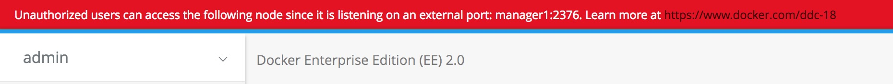

3. Navigate to `Swarm` --> `Secrets` on the left hand menu. And then click `Create Secret`.
    > 

4. We are going to create a secret titled `title_v1`. The Content of the secret doesn't matter. Here is an idea `2018 Docker Government Summit is fun and secure.` We do not need to add it to a collection at this point. It will default to our private collection.
    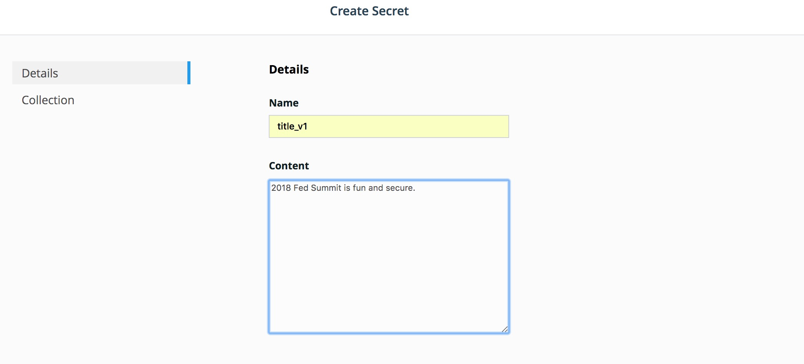

5. Now let's create a second secret called `title_v2` with the content `2018 Dockercon in San Francisco might be more fun.`.
  

6. You should now have two secrets named `title_v1` and `title_v2`.
  

Perfect. Now we can deploy a services that will use the first secret.


## <a name="task3"></a>Task 3: Deploy Docker Stack
Background: A Stack is a collection of services described in a single yaml. And deployed as a single unit. This can be very helpful when deploying large sets of services.

We are going to use a `Stack` to deploy a `Service` that will use the newly created secrets.

1. Navigate to `Shared Resources` --> `Stacks` on the left hand menu. And then click `Create Stack`.
2. Name can be anything unique. let's use `summit`. The Mode should be `Swarm Services`. And paste in the following:

  ```yaml
  version: "3.3"
  services:
      app:
        image: clemenko/fedsummit_2018
        deploy:
          replicas: 2
          mode: replicated
          placement:
            constraints:
              - 'node.role == worker'
        ports:
          - 5000:5000
        secrets:
          - source: title_v1
            target: secret

  secrets:
      title_v1:
        external: true
  ```
   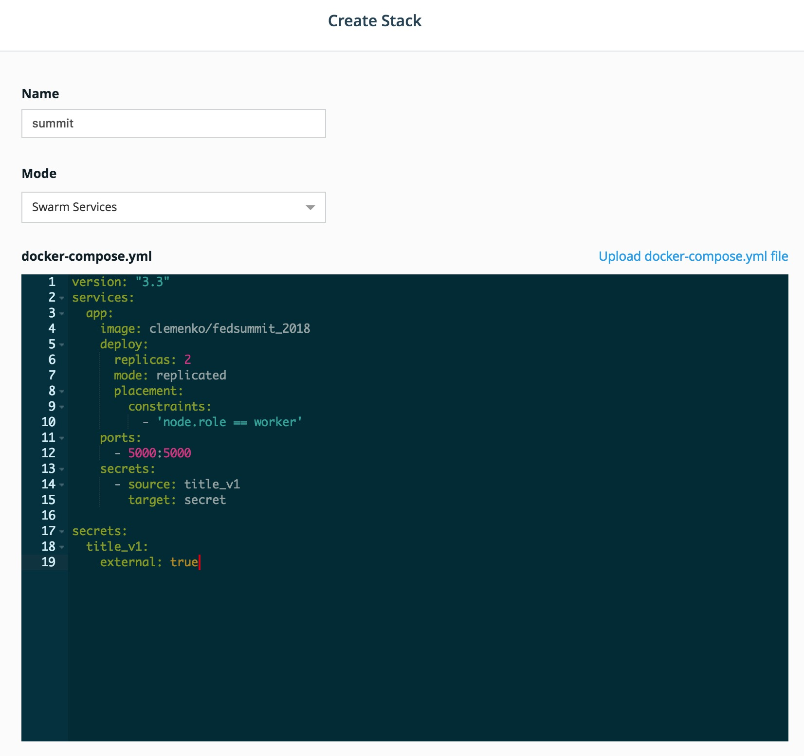

3. Once the deploy is complete click `Done`. No we can verify it is deployed by navigating to `Shared Resources` --> `Services` and look for the `summit_app` service.

  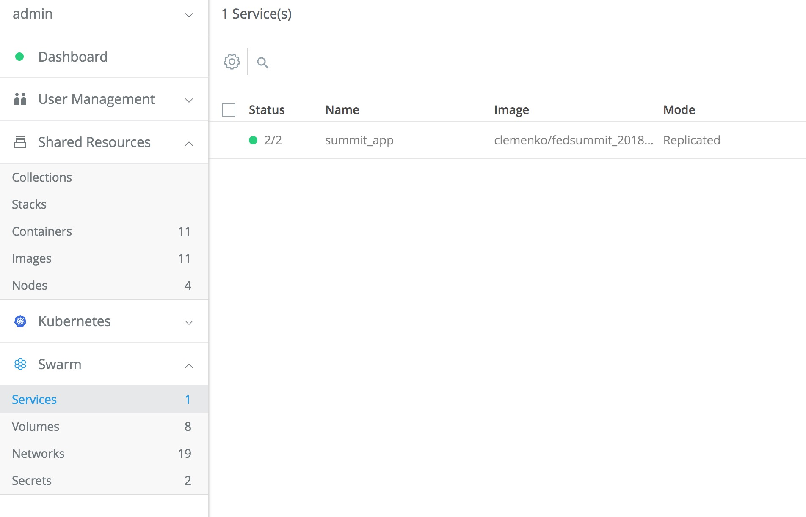

4. Let's check the resulting webpage. Click on the service itself --> `summit_app`. You will notice a Right hand menu appear. Here you will find a `Published Endpoints` section. Click on the endpoint.
  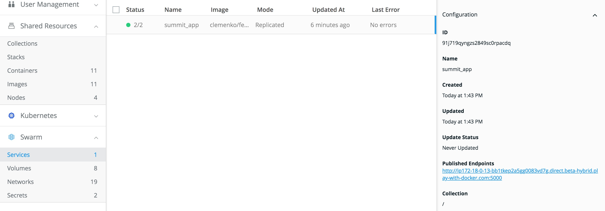

5. Once the page has loaded. Hit `Refresh` in the browser. Notice the `server` field change? There are actually two containers that are using the same secret.
  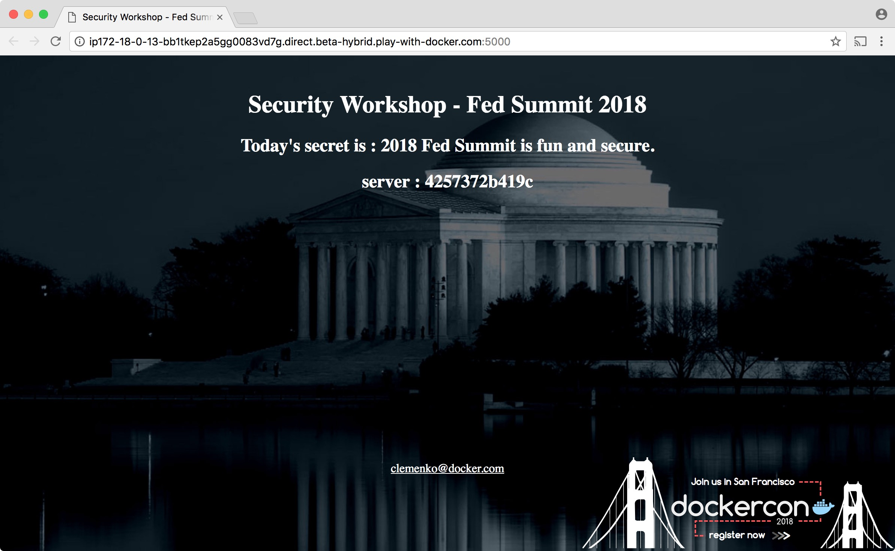

### <a name="task3.1"></a>Task 3.1: Update Service
To show some of the flexibility of secrets we can update the service to use the new secret.

1. Navigate back to UCP --> `Swarm` --> `Services` --> `summit_app`. This time instead of clicking on the endpoint. Let's click on `Configure` --> `Environment`.
  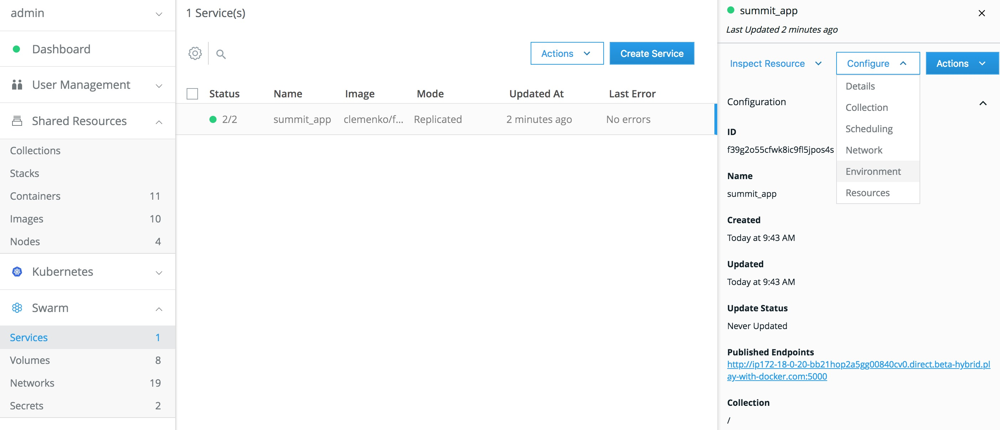

2. Remove the old Secret by clicking the `X` on the right hand side.
   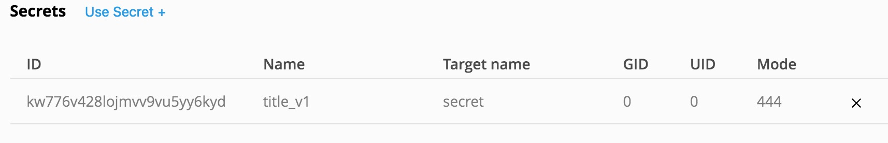

3. Add the new secret by clicking `Use Secret +`. The `Secret Name` is now `title_v2`. The `Target Name` should be `secret`. You an compare this to the stack we deployed earlier. Click `Confirm` to complete the addition.
 > **Note**: Notice the Name changed and the Target Name is the same.

 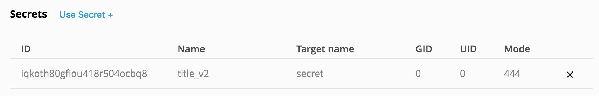

4. Click `Save` to complete the update.
5. Now go back to the tab with the webpage and hit refresh. Keep refreshing and notice the change in the the `server` field and the secret. You effectively created a rolling update of the service without loosing availability to the app.

## <a name="task4"></a>Task 4: Create DTR Repository
We now need to access Docker Trusted Registry to setup two repositories.

### <a name="task4.1"></a>Task 4.1: Enable Docker Image Scanning
Before we create the repositories, let's start with enabling the Docker Image Scanning engine.

1. From the main PWD screen click the `DTR` button on the left side of the screen

	> **Note**: Because this is a lab-based install of Docker EE we are using the default self-signed certs. Because of this your browser may display a security warning. It is safe to click through this warning.
	>
	> In a production environment you would use certs from a trusted certificate authority and would not see this screen.
	>
	> 

2.  Navigate to `System` --> `Security`.
3.  Select `Enable Scanning`. In the popup leave it in `Online` mode and select `Enable`. The CVE database will start downloading. This can take a few minutes. Please be patient for it to complete.
    

### <a name="task4.2"></a>Task 4.2: Create Repositories
We can now create the two repositories.

1. Navigate to `Repositories` on the left menu and click `New repository`.
2. Create that looks like `admin`/`alpine_build`. Make sure you click `Private`. Do not click `Create` yet!
3. Click `Show advanced settings` and then click `On Push` under `SCAN ON PUSH`.  This will ensure that the CVE scan will start right after every push to this repository.  Click `Create`.
  

 4. Now let's create the second repository in a similar fashion. Create a `Public` repository as `admin`/`alpine` with `SCAN ON PUSH` set to `On Push`.

 5. We should have two repositories now.
    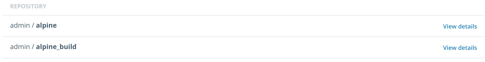

### <a name="task4.3"></a>Task 4.3: Create Promotion Policy
With the two repositories setup we can now define the promotion policy. We need to create a target policy that has a `CRITERIA` of `Critical Vulnerabilities` equal to zero. The policy will target the `admin`/`alpine` repository.

1. Navigate to the `admin`/`alpine_build` repository. Click `Promotions` and click `New promotion policy`.
2. In the `PROMOTE TO TARGET IF...` box select `Critical Vulnerabilities` and then check `equals`. In the box below `equals` enter the number zero (0) and click `Add`.
3. Set the `TARGET REPOSITORY` to `admin`/`alpine` and click `Save & Apply`.
  

 Perfect. Now let's push am image that will be scanned and promoted.

## <a name="task5"></a>Task 5: Pull / Push Docker Image
In order to push and pull images to DTR we will need to take advantage of PWD's Console Access.

1. Navigate back to the PWD tab in your browser.
2. Click on `worker1`. Honestly, it doesn't matter which worker we use. We just need a docker daemon.
3. In the console we need to create a variable called `URL` from the `DTR Hostname`. This will greatly reduce the amount of typing. Locate the url.

     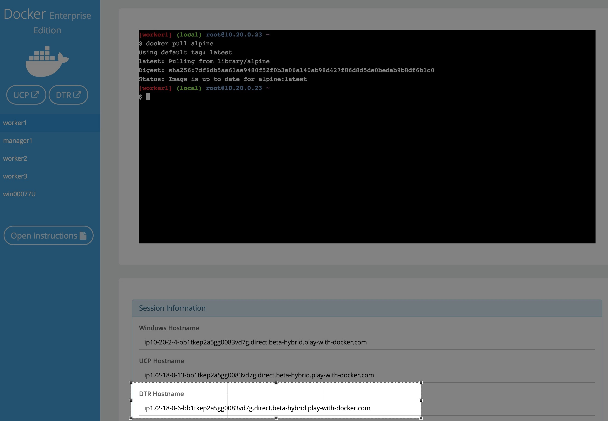

  In the console type :
  >**Note:** Change the `URL` to what is listed for your DTR Hostname.

  ```
  URL=ip172-18-0-6-bb1tkep2a5gg0083vd7g.direct.beta-hybrid.play-with-docker.com
  ```

4. Now we can start pulling images.

  ```
  docker pull alpine
  ```
  This command is pulling the `alpine` image from [hub.docker.com](https://hub.docker.com).

  ```
  [worker1] (local) root@10.20.0.23 ~
  $ docker pull alpine
  Using default tag: latest
  latest: Pulling from library/alpine
  Digest: sha256:7df6db5aa61ae9480f52f0b3a06a140ab98d427f86d8d5de0bedab9b8df6b1c0
  Status: Image is up to date for alpine:latest
 ```

5. Now let's tag the image for our DTR instance. We will use the `URL` variable we set before.
   The tag command looks like `docker image tag <FROM> <TO>`.

   ```
   docker image tag alpine $URL/admin/alpine_build
   ```


6. Now let's `docker login` into our DTR instance with the `admin` credentials.

  ```
  docker login -u admin $URL
  ```
7. Now we can `docker push` the image to DTR.

  ```
  docker push $URL/admin/alpine_build
  ```

8. With the completed `docker push` we can now navigate back to the DTR's gui. From the gui we can check on the image scan. Navigate to `Repositories` --> `admin/alpine_build`--> `IMAGES`. You should see a similar image tagged `latest`.
 >**Note:** Did your image scan clean?

  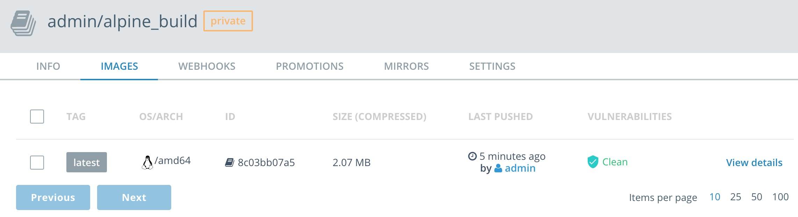

8. Now let's check the `admin/alpine` images. Navigate to `Repositories` --> `admin/alpine`--> `IMAGES`.
 >**Note:** Do you see the `PROMOTED` badge?

  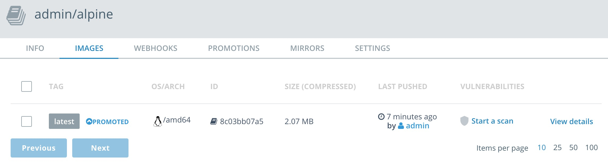

## <a name="task6"></a>Task 6: Bad Docker Image
Let's take a look at pushing an older image that we know will have some vulnerabilities.

1. Docker pull :

   ```
   docker pull alpine:3.1
   ```


2. Tag and push to DTR.

    ```
    docker tag alpine:3.1 $URL/admin/alpine_build:3.1
    ```

    and

    ```
    docker push $URL/admin/alpine_build:3.1
    ```


3. Navigate to DTR --> `Repostories` --> `admin/alpine` --> `Images`.
    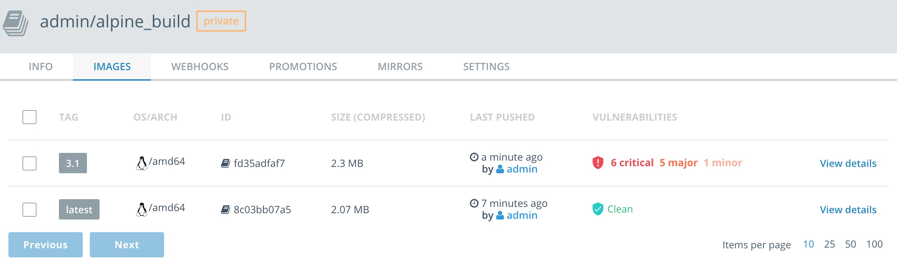

4. Take a look at the details to see exactly what piece of the image is vulnerable.
    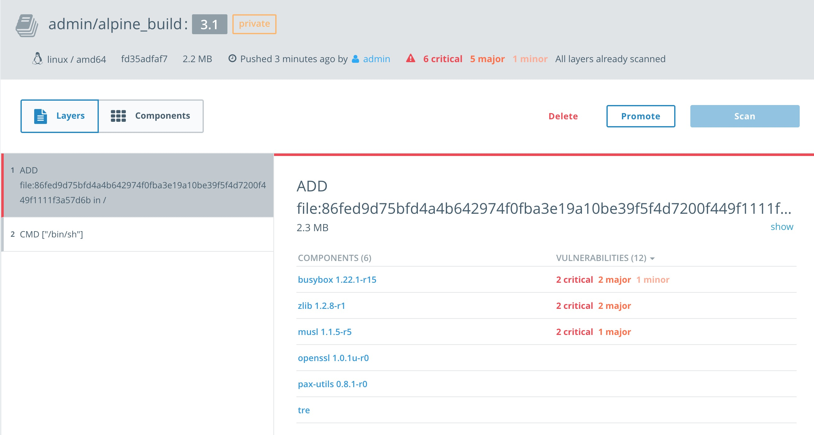


## <a name="task7"></a>Task 7: Docker Content Trust
Docker Content Trust/Notary is a tool for publishing and managing trusted collections of content. Publishers can digitally sign collections and consumers can verify integrity and origin of content. This ability is built on a straightforward key management and signing interface to create signed collections and configure trusted publishers.

Docker Content Trust/Notary provides a cryptographic signature for each image. The signature provides security so that the image requested is the image you get. Read [Notary's Architecture](https://docs.docker.com/notary/service_architecture/) to learn more about how Notary is secure. Since Docker EE is "Secure by Default," Docker Trusted Registry comes with the Notary server out of the box.

In addition, Docker Content Trust allows for threshold signing and gating for the releases. Under this model, software is not released until all necessary parties (or a quorum) sign off. This can be enforced by requiring (and verifying) the needed signatures for an image. This policy ensures that the image has made it through the whole process: if someone tries to make it skip a step, the image will lack a necessary signature, thus preventing deployment of that image.

The following examples shows the basic usage of Notary. To use image signing, create a repository in DTR and enable it on the local Docker engine. First, enable the client, and sign an image. Let's use the `admin/alpine` image.

1. Pull the image locally.

   ```
   docker pull $URL/admin/alpine
   ```

2. Enable Docker Content Trust on the client side.

   ```
   export DOCKER_CONTENT_TRUST=1
   ```

3. Push the alpine image back.
 >**Note:** For Docker Content Trust you need to push/pull with the tag. Defaulting to latest doesn't work.

   ```
   docker push $URL/admin/alpine:latest
   ```

   Pushing with `DOCKER_CONTENT_TRUST=1` will check If the necessary keys are setup. If not, the docker client will ask you to generate them. As you can see in the example below you will need to create a `root` key password and a `repository` key password. Feel free to enter any password. Here is an example:

  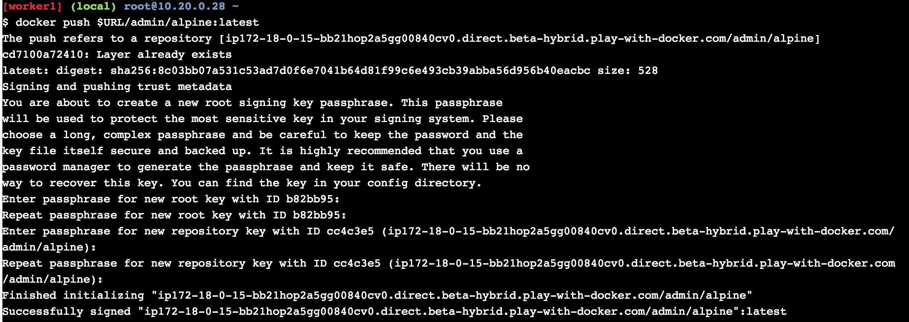

4. Review the repository on DTR now.

  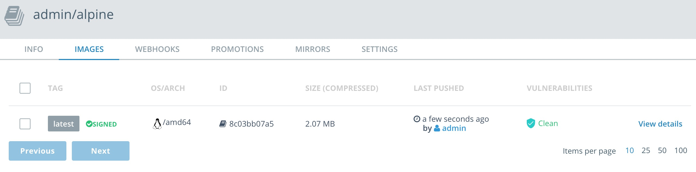


## <a name="Conclusion"></a>Conclusion
In this lab we been able to leverage the power of Docker Enterprise Edition for creating and using secrets. We also were able to create the foundation of a secure supply chain with Docker Image Scanning and Docker Content Trust.
