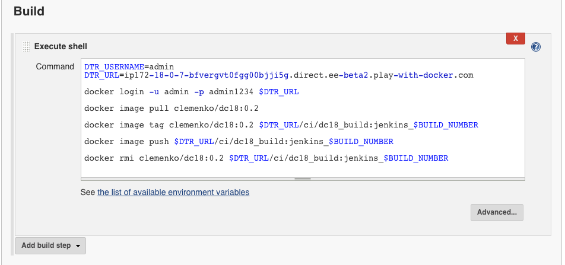

# Secure, Automated Software Supply Chain - Dockercon 2018

In this lab you will integrate Docker Enterpise Edition Advanced in to your development pipeline. You will build your application from a Dockerfile and push your image to the Docker Trusted Registry (DTR). DTR will scan your image for vulnerabilities so they can be fixed before your application is deployed. This helps you build more secure apps!


> **Difficulty**: Intermediate

> **Time**: Approximately 90 minutes

> **Tasks**:
>
> * [Prerequisites](#prerequisites)
> * [Introduction](#introduction)
> * [Task 1: Accessing PWD](#task1)
>   * [Task 1.1: Set Up Environment Variables](#task1.1)
> * [Task 2: Enable Docker Image Scanning](#task2)
> * [Task 3: Create Jenkins User and Organization](#task3)
>   * [Task 3.1: Create Jenkins Organization](#task3.1)
>   * [Task 3.2: Create Jenkins User](#task3.2)
>   * [Task 3.3: Create Jenkins DTR Token](#task3.3)
> * [Task 4: Create DTR Repository](#task4)
>   * [Task 4.1: Create Promotion Policy (Private to Public)](#task4.1)
> * [Task 5: Pull / Tag / Push Docker Image ](#task5)
> * [Task 6: Review Scan Results ](#task6)
>   * [Task 6.1: Hide Vulnerabilities ](#task6.1)
>   * [Task 6.2: Manually Promote Image ](#task6.2)
> * [Task 7: Extend with Image Mirroring ](#task7)
> * [Task 8: Docker Content Trust / Image Signing ](#task8)
> * [Task 9: Automate with Jenkins ](#task9)
>   * [Task 9.1: Deploy Jenkins](#task9.1)
>   * [Task 9.2: Plumb Jenkins](#task9.2)
>   * [Task 9.3: Webhooks](#task9.3)
> * [Conclusion](#conclusion)

## Document conventions
When you encounter a phrase in between `<` and `>`  you are meant to substitute in a different value.
We are going to leverage the power of [Play With Docker](http://play-with-docker.com).

## <a name="abbreviations"></a>Abbreviations
The following abbreviations are used in this document:

* UCP = Universal Control Plane
* DTR = Docker Trusted Registry
* DCT = Docker Content Trust
* EE = Docker Enterprise Edition
* CVE = Common Vulnerabilities and Exposures
* PWD = Play With Docker

## <a name="prerequisites"></a>Prerequisites
This lab requires an instance of Docker Enterprise Edition (EE). Docker Enterprise Edition includes Docker Universal Control Plane and Docker Trusted Registry. This lab provides Docker EE.

## Understanding the Play With Docker Interface


This workshop is only available to people in a pre-arranged workshop. That may happen through a [Docker Meetup](https://events.docker.com/chapters/), a conference workshop that is being led by someone who has made these arrangements, or special arrangements between Docker and your company. The workshop leader will provide you with the URL to a workshop environment that includes [Docker Enterprise Edition](https://www.docker.com/enterprise-edition). The environment will be based on [Play with Docker](https://labs.play-with-docker.com/).

If none of these apply to you, contact your local [Docker Meetup Chapter](https://events.docker.com/chapters/) and ask if there are any scheduled workshops. In the meantime, you may be interested in the labs available through the [Play with Docker Classroom](training.play-with-docker.com).

There are three main components to the Play With Docker (PWD) interface.

### 1. Console Access
Play with Docker provides access to the 3 Docker EE hosts in your Cluster. These machines are:

* A Linux-based Docker EE 2.0 (UCP 3.0.1 & 17.06.2-ee11)  Manager node
* Three Linux-based Docker EE 2.0 (17.06.2-ee11) Worker nodes
* A Windows Server 2016-based Docker EE 17.06 Worker Node

By clicking a name on the left, the console window will be connected to that node.

### 2. Access to your Universal Control Plane (UCP) and Docker Trusted Registry (DTR) servers
Additionally, the PWD screen provides you with a one-click access to the Universal Control Plane (UCP)
web-based management interface as well as the Docker Trusted Registry (DTR) web-based management interface. Clicking on either the `UCP` or `DTR` button will bring up the respective server web interface in a new tab.

### 3. Session Information
Throughout the lab you will be asked to provide either hostnames or login credentials that are unique to your environment. These are displayed for you at the bottom of the screen.

**Note:**  There are a limited number of lab connections available for the day. You can use the same session all day by simply keeping your browser connection to the PWD environment open between sessions. This will help us get as many people connected as possible, and prevent you needing to get new credentials and hostnames in every lab. However, if you do lose your connection between sessions simply go to the PWD URL again and you will be given a new session.

## <a name="introduction"></a> Introduction
This workshop is designed to demonstrate the power of Docker Secrets, Image Promotion, Scanning Engine, and Content Trust. We will walk through creating a few secrets. Deploying a stack that uses the secret. Then we will create a Docker Trusted Registry repository where we can create a promotion policy. The promotion policy leverages the output from Image Scanning result. This is the foundation of creating a Secure Supply Chain. You can read more about  secure supply chains for our [Secure Supply Chain reference architecture](https://success.docker.com/article/secure-supply-chain).

## <a name="task 1"></a>Task 1: Accessing PWD
1. Navigate in your web browser to the URL the workshop organizer provided to you.

2. Fill out the form, and click `submit`. You will then be redirected to the PWD environment.

	It may take a minute or so to provision out your PWD environment.

### <a name="task1.1"></a>Task 1.1: Set Up Environment Variables
We are going to use `worker3` for **ALL** our command line work. Click on `worker3` to activate the shell.


Now we need to setup a few variables. We need to create `DTR_URL` and `DTR_USERNAME`. But the easiest way is to clone the Workshop Repo and run script.

```
git clone https://github.com/clemenko/dc18_supply_chain.git
```

Once cloned, now we can run the `var_setup.sh` script.

```
. dc18_supply_chain/scripts/var_setup.sh
```

Now your PWD environment variables are setup. We will use the variables for some scripting.


## <a name="task2"></a>Task 2: Enable Docker Image Scanning
Before we create the repositories, let's start with enabling the Docker Image Scanning engine.

1. From the main PWD screen click the `DTR` button on the left side of the screen

	> **Note**: Because this is a lab-based install of Docker EE we are using the default self-signed certs. Because of this your browser may display a security warning. It is safe to click through this warning.
	>
	> In a production environment you would use certs from a trusted certificate authority and would not see this screen.
	>
	> 

2.  Navigate to `System`on the left pane, then `Security`.


3.  Select `Enable Scanning`. Leave it in `Online` mode and select `Enable`. The CVE database will start downloading. This can take a few minutes. Please be patient for it to complete.


**You will notice the yellow banner while DTR is downloading the CVE database. It will take some time to download.**

## <a name="task3"></a>Task 3: Create Jenkins User and Organization
In order to setup our automation we need to create an organization and a user account for Jenkins. We are going to create a user named `jenkins` in the organization `ci`.

### <a name="task3.1"></a>Task 3.1: Create Jenkins Organization
1. From the `PWD` main page click on `DTR`.


2. Once in `DTR` navigate to `Organizations` on the left.
3. Now click `New organization`.
4. Type in `ci` and click `Save`.


Now we should see the organization named `ci`.


### <a name="task3.2"></a>Task 3.2: Create Jenkins User
While remaining in DTR we can create the user from here.

1. Click on the organization `ci`.
2. Click `Add user`.
3. Make sure you click the radio button `New`. Add a new user name `jenkins`. Set a simple password that you can remember. Maybe `admin1234`?


Now change the permissions for the `jenkins` account to `Org Owner`.


### <a name="task3.3"></a>Task 3.3: Create Jenkins DTR Token
Now that we have the `jenkins` user created we need to add a token for use with DTR's API.

Navigate to `Users` on the left pane. Click on `jenkins`, then click the `Access Tokens` tab.


Click `New access token`. Enter `api` into the description field and click `Create`.

**Write down the token that is displayed. You will need this again!**

It should look like `ee9d7ff2-6fd4-4a41-9971-789e06e0d5d5`. Click `Done`.

Lets add it to the `worker3` environment. Replace `<TOKEN>` with the token from DTR.

```
#example
#export DTR_TOKEN=ee9d7ff2-6fd4-4a41-9971-789e06e0d5d5
export DTR_TOKEN=<TOKEN>
```

## <a name="task4"></a>Task 4: Create DTR Repository
We now need to access Docker Trusted Registry to setup two repositories.

We have an easy way with a script or the hard way by using the GUI.

Either way we need to create two repositories, `dc18_build` and `dc18`. `dc18_build` will be used for the private version of the image. `dc18` will be the public version once an CVE scan is complete.

**Easy Way:**

Since we used `git clone` to copy the repository to `worker3` for this workshop, there is a script from that will create the DTR repositories.

```
./dc18_supply_chain/scripts/create_repos.sh
```

Feel free to `cat` the file to see how we are using `curl` and the API to create the repositories.

```
[worker3] (local) root@10.20.0.38 ~
$ cat dc18_supply_chain/scripts/create_repos.sh
#!/bin/bash
# requires environment variables: DTR_HOST, DTR_USERNAME and DTR_TOKEN

if [ -z "$DTR_TOKEN" ]; then
  echo " Please create a DTR_TOKEN variable before preceeding..."
  exit
fi

curl -X POST -k -L \
  -u $DTR_USERNAME:$DTR_TOKEN \
  https://$DTR_URL/api/v0/repositories/ci \
  -H 'Content-Type: application/json' \
  -d '{
  "enableManifestLists": true,
  "immutableTags": true,
  "longDescription": "",
  "name": "dc18",
  "scanOnPush": true,
  "shortDescription": "Dockercon 2018 Example - public",
  "visibility": "public"
}'

curl -X POST -k -L \
  -u $DTR_USERNAME:$DTR_TOKEN \
  https://$DTR_URL/api/v0/repositories/ci \
  -H 'Content-Type: application/json' \
  -d '{
  "enableManifestLists": true,
  "immutableTags": true,
  "longDescription": "",
  "name": "dc18_build",
  "scanOnPush": true,
  "shortDescription": "Dockercon 2018 Example - private",
  "visibility": "public"
}'
```

**Hard Way:**

1. Navigate to `Repositories` on the left menu and click `New repository`.
2. Create that looks like `ci`/`dc18_build`. Make sure you click `Private`. Do not click `Create` yet!
3. Click `Show advanced settings` and then click `On Push` under `SCAN ON PUSH`.  This will ensure that the CVE scan will start right after every push to this repository.  And turn on `IMMUTABILITY `. Then click `Create`.


4. Repeat this for creating the `ci`/`dc18` `Public` repository with `SCAN ON PUSH` set to `On Push`.
5. We should have two repositories now.
    

### <a name="task4.1"></a>Task 4.1: Create Promotion Policy - Private to Public
With the two repositories setup we can now define the promotion policy. The first policy we are going to create is for promoting an image that has passed a scan with zero (0) **Critical** vulnerabilities. The policy will target the `ci`/`dc_18` repository.

1. Navigate to the `ci`/`dc18_build` repository. Click `Promotions` and click `New promotion policy`. Note: Make sure the `Is source` box is
selected.
  

2. In the `PROMOTE TO TARGET IF...` box select `Critical Vulnerabilities` and then check `equals`. In the box below `equals` enter the number zero (0) and click `Add`.
3. Set the `TARGET REPOSITORY` to `ci`/`dc18` and click `Save & Apply`.
  

When we push an image to `ci`/`dc18_build` it will get scanned. Based on that scan report we could see the image moved to `ci`/`dc18`. Lets push a few images to see if it worked.

## <a name="task5"></a>Task 5: Pull / Tag / Push Docker Image
Lets pull, tag, and push a few images to YOUR DTR.

In order to push and pull images to DTR we will need to take advantage of PWD's Console Access.

1. Navigate back to the PWD tab in your browser.
2. Click on `worker3`.
3. In the console we should already have a variable called `DTR_URL`. Lets check.

	```
	echo $DTR_URL
	```

  If you are not sure please follow [Task 1.1: Set Up Environment Variables](#task1.1).


4. Now we login to our DTR server using your `DTR_TOKEN` from [Task 3.3: Create Jenkins DTR Token](#task3.3).

	```
	docker login -u jenkins -p $DTR_TOKEN $DTR_URL
	```

5. Now we can start pulling a few images.

	  ```
	docker pull clemenko/dc18:0.1
	docker pull clemenko/dc18:0.2
	docker pull clemenko/dc18:0.3
	docker pull alpine
	  ```

  This command is pull a few images from [hub.docker.com](https://hub.docker.com).

6. Now let's tag the image for our DTR instance. We will use the `URL` variable we set before.

	```
	docker tag clemenko/dc18:0.1 $DTR_URL/ci/dc18_build:0.1
	docker tag clemenko/dc18:0.2 $DTR_URL/ci/dc18_build:0.2
	docker tag clemenko/dc18:0.3 $DTR_URL/ci/dc18_build:0.3
	docker tag alpine $DTR_URL/ci/dc18_build:alpine
	 ```

7. Now we can `docker push` the images to DTR.

	```
	docker push $DTR_URL/ci/dc18_build:0.1
	docker push $DTR_URL/ci/dc18_build:0.2
	docker push $DTR_URL/ci/dc18_build:0.3
	docker push $DTR_URL/ci/dc18_build:alpine
	```

## <a name="task6"></a>Task 6: Review Scan Results
Lets take a good look at the scan results from the images. Please keep in mind this will take a few minutes to complete.

1. Navigate to DTR --> `Repostories` --> `ci/dc18_build` --> `Images`.

	Do worry if you see images in a `Scanning...` or `Pending` state. Please click to another tab and click back.

    

2. Take a look at the details to see exactly what piece of the image is vulnerable.

     

     Click `View details` for an image that has vulnerabilities. How about `0.2`? There are two views for the scanning results, **Layers** and **Components**. The **Layers** view shows which layer of the image had the vulnerable binary. This is extremely useful when diagnosing where the vulnerability is in the Dockerfile.

     

    The vulnerable binary is displayed, along with all the other contents of the layer, when you click the layer itself. In this example there are a few potentially vulnerable binaries:

    

    Now we have a chance to review each vulnerability by clicking the CVE itself, example `CVE-2018-0500`. This will direct you to Mitre's site for CVEs.

    

    Now that we know what is in the image. We should probably act upon it.

### <a name="task6.1"></a>Task 6.1: Hide Vulnerabilities
If we find that they CVE is a false positive. Meaning that it might be disputed, or from OS that you are not using. If this is the case we can simply `hide` the vulnerability. This will not remove the fact that the CVE was found.

Click `hide` for the one critical CVE.
	

If we click back to `Images` we can now see that the image does not have a critical vulnerability.
	

Once we have hidden some CVEs we might want to perform a manual promotion of the image.

### <a name="task6.2"></a>Task 6.2: Manually Promote Image
Manual promotions are useful for those times that you need to move an image from a `Private` repository to a `Public` one. To perform a manual promotion :

1. Click on an image's details. Lets go back to `0.2`, now click `Promote`. Lets `Promote` the image to `ci`/`dc18` with a tag of `promoted`.

     

2. Click `Promote`.
    Lets look at the promoted image.

3. Navigate to `ci`/`dc18` --> `Images`. The `promoted` TAG should exist.

      

      Now that we use automated and manual promotions. Maybe we can extend promoting images beyond DTR.

## <a name="task7"></a>Task 7: Extend with Image Mirroring
Docker Trusted Registry allows you to create mirroring policies for a repository. When an image gets pushed to a repository and meets a certain criteria, DTR automatically pushes it to repository in another DTR deployment or Docker Hub.

This not only allows you to mirror images but also allows you to create image promotion pipelines that span multiple DTR deployments and datacenters. Let's set one up. How about we mirror an image to [hub.docker.com](https://hub.docker.com)?

1. Go to [hub.docker.com](https://hub.docker.com) and create an login and repository.

2. Navigate to `Repositories` --> `ci`/`dc18` --> `MIRRORS` --> `New mirror`.
   Change the `REGISTRY TYPE` to `Docker Hub` and fill out the relevant information like:

   

3. Click `Connect` and scroll down.
4. Next create a `tag name` Trigger that is equal to `promoted`
5. Leave the `%n` tag renaming the same.
6. Click `Save & Apply`.

	 


Since we already had an image that had the tag `promoted` we should see that the image was pushed to [hub.docker.com](https://hub.docker.com). In fact we can click on the [hub](https://hub.docker.com) repository name to see if the image push was successful.


## <a name="task8"></a>Task 8: Docker Content Trust / Image Signing
Docker Content Trust/Notary provides a cryptographic signature for each image. The signature provides security so that the image requested is the image you get. Read [Notary's Architecture](https://docs.docker.com/notary/service_architecture/) to learn more about how Notary is secure. Since Docker EE is "Secure by Default," Docker Trusted Registry comes with the Notary server out of the box.

We can create policy enforcement within Universal Control Plane (UCP) such that **ONLY** signed images from the `ci` team will be allowed to run. Since this workshop is about DTR and Secure Supply Chain we will skip that step.

Let's sign our first Docker image?

1. Right now you should have a promoted image `$DTR_URL/ci/dc18:promoted`. We need to tag it with a new `signed` tag.

   ```
	 docker pull $DTR_URL/ci/dc18:promoted
   docker tag $DTR_URL/ci/dc18:promoted $DTR_URL/ci/dc18:signed
   ```

2. Now lets use the Trust command... It will ask you for a BUNCH of passwords. Do yourself a favor in this workshop and use `admin1234`. :D

    ```
    docker trust sign $DTR_URL/ci/dc18:signed
    ```

    Here is an example output:

	```
	[worker3] (local) root@10.20.0.42 ~
	$ docker trust sign $DTR_URL/ci/dc18:signed
	You are about to create a new root signing key passphrase. This passphrase
	will be used to protect the most sensitive key in your signing system. Please
	choose a long, complex passphrase and be careful to keep the password and the
	key file itself secure and backed up. It is highly recommended that you use a
	password manager to generate the passphrase and keep it safe. There will be no
	way to recover this key. You can find the key in your config directory.
	Enter passphrase for new root key with ID b975982:
	Repeat passphrase for new root key with ID b975982:
	Enter passphrase for new repository key with ID 61a14ae:
	Repeat passphrase for new repository key with ID 61a14ae:
	Enter passphrase for new jenkins key with ID ab5049d:
	Repeat passphrase for new jenkins key with ID ab5049d:
	Created signer: jenkins
	Finished initializing signed repository for ip172-18-0-5-bfu00sinjdg00099igu0.direct.ee-beta2.play-with-docker.com/ci/dc18:signed
	Signing and pushing trust data for local image ip172-18-0-5-bfu00sinjdg00099igu0.direct.ee-beta2.play-with-docker.com/ci/dc18:signed, may overwrite remote trust data
	The push refers to repository [ip172-18-0-5-bfu00sinjdg00099igu0.direct.ee-beta2.play-with-docker.com/ci/dc18]
	af9af2170d23: Layer already exists
	cd9a82baa926: Layer already exists
	c60ea83f6a45: Layer already exists
	cd7100a72410: Layer already exists
	signed: digest: sha256:5554013b565fc0ccf080f7cf4ad096ffb1dbc4f83496a86f9efa1252f26ed455 size: 1156
	Signing and pushing trust metadata
	Enter passphrase for jenkins key with ID ab5049d:
	Successfully signed ip172-18-0-5-bfu00sinjdg00099igu0.direct.ee-beta2.play-with-docker.com/ci/dc18:signed
	[worker3] (local) root@10.20.0.42 ~
	```

	Again please use the same password. It will simplify this part of the workshop.

3. And we can confirm the signature has been applied by inspecting the image:

	```
	docker trust inspect
	```

	Here is the example output:

	```
	[worker3] (local) root@10.20.0.42 ~
	$ docker trust inspect $DTR_URL/ci/dc18:signed
	[
    {
        "Name": "ip172-18-0-5-bfu00sinjdg00099igu0.direct.ee-beta2.play-with-docker.com/ci/dc18:signed",
        "SignedTags": [
            {
                "SignedTag": "signed",
                "Digest": "5554013b565fc0ccf080f7cf4ad096ffb1dbc4f83496a86f9efa1252f26ed455",
                "Signers": [
                    "jenkins"
                ]
            }
        ],
        "Signers": [
            {
                "Name": "jenkins",
                "Keys": [
                    {
                        "ID": "ab5049def46b1b8070891981afe6091f95bf9017cdfc447866917f342810a302"
                    }
                ]
            }
        ],
        "AdministrativeKeys": [
            {
                "Name": "Root",
                "Keys": [
                    {
                        "ID": "59eaa1440dfc9fbf709a9640e8b8fbcb636b019f6f70aa90451f361bbd1ecf58"
                    }
                ]
            },
            {
                "Name": "Repository",
                "Keys": [
                    {
                        "ID": "61a14ae35425dde74dc5d18b292c613f613b357051862c18ca5d0a02a2f0d04e"
                    }
                ]
            }
        ]
    }
	]
	[worker3] (local) root@10.20.0.42 ~
	```

4. Back in DTR, Navigate to `Repositories` --> `ci`/`dc18` --> `Tags` and you will now see the new `signed` tag with the text `Signed`
	under the `Signed` column:

	

## <a name="task9"></a>Task 9: Automate with Jenkins
In order to automate we need to deploy Jenkins. If you want I can point you to a few Docker Compose yamls. OR we have the easy way. The easy, aka script, deploys Jenkins quickly.

### <a name="task9.1"></a>Task 9.1: Deploy Jenkins

1.  Take a look at the script. Also notice the script will check variables, and then runs `docker run`.

	```
	cat ./dc18_supply_chain/scripts/jenkins.sh
	```

2.  Then run unset Docker Content Trust and instal Jenkins.

	```
  export DOCKER_CONTENT_TRUST=0
	./dc18_supply_chain/scripts/jenkins.sh
	```

3.  Pay attention to the url AND Jenkins password. It will look like :

	```
	[worker3] (local) root@10.20.0.25 ~/
	$ dc18_supply_chain/scripts/jenkins.sh
	=========================================================================================================

	  Jenkins URL : http://ip172-18-0-20-bcelih5dffhg00b2thog.direct.ee-beta2.play-with-docker.com:8080

	=========================================================================================================
	  Waiting for Jenkins to start................
	=========================================================================================================

	  Jenkins Setup Password = d32eda1cf2464b818826fd82b4f7c2cb

	=========================================================================================================
	```

4. Now navigate to `http://$DOCS_URL:8080` by clicking on the url in the terminal. Let's start the setup of Jenkins and enter the password. It may take a minute or two for the `Unlock Jenkins` page to load. Be patient.
	

5. Click `Install suggested plugins`.
	

6. Next Click `Continue as admin` in the lower right hand corner. We don't need to create another username for Jenkins.
	

7. Next for Instance Configuration click `Save and Finish`.
	

8. And we are done installing Jenkins. Click `Start using Jenkins`
	


### <a name="task9.2"></a>Task 9.2: Plumb Jenkins
Now that we have Jenkins setup and running we need to add 2 additional plugins - Blue Ocean and Generic Webhook Trigger:

1. Click on `Manage Jenkins` --> `Manage Plugins` --> `Available` and filter/search for `Blue Ocean` and `Generic Webhook Trigger`. When you have found each one check the checkbox to the left of the plugin name to select for installation.

2. Click on `Install without restart` and wait for the plugins to install. When all plugins have installed naviagte back to the Jenkins homepage.

3. Click on `New item` in the upper left.
	

4. Enter a name like `ci_dc18`, click `Freestyle project` and then click `OK`.
	

5. Let's scroll down to the `Build` section. We will come back to the `Build Triggers` section in a bit. Now click `Add build step` --> `Execute shell`.
	

6. You will now see a text box. Past the following build script into the text box.

	**Please replace the <DTR_URL> with your URL! `echo $DTR_URL` <-- `worker3`**

	```
	DTR_USERNAME=admin
	DTR_URL=<DTR_URL>

	docker login -u admin -p admin1234 $DTR_URL

	docker pull clemenko/dc18:0.2

	docker tag clemenko/dc18:0.2 $DTR_URL/ci/dc18_build:jenkins_$BUILD_NUMBER

	docker push $DTR_URL/ci/dc18_build:jenkins_$BUILD_NUMBER

	docker rmi clemenko/dc18:0.1 clemenko/dc18:0.2 $DTR_URL/ci/dc18_build:jenkins_$BUILD_NUMBER
	```

	It will look very similar to:
	

	Now scroll down and click `Save`.

7. Now let's run the build. Click `Build now`.
	

8. You can watch the output of the `Build` by clicking on the task number in the `Build History` and then selecting `Build Output`
	

9. The console output will show you all the details from the script execution.
	

10. Review the `ci`/`dc18` repository in DTR. You should now see a bunch of tags that have been promoted.
	

### <a name="task9.2"></a>Task 9.2: Webhooks
Now that we have Jenkins setup we can extend with webhooks. In Jenkins speak a webhook is simply a build trigger. Let's configure one.

1. Navigate to Jenkins and click on the project/item called `ci_dc18` and click on `Configure` on the left hand side.
	

2. Then scroll down to `Build Triggers`. Check the radio button for `Generic Webhook Trigger` and enter a Token of `dc18_rocks`.  Scroll down and click `Save`.
	

3. Now in your browser goto YOUR `http://$DOCS_URL:8080/generic-webhook-trigger/invoke?token=dc18_rocks`

	It should look like: `http://ip172-18-0-6-bcg2h0npobfg00c4nrb0.direct.ee-beta2.play-with-docker.com:8080/generic-webhook-trigger/invoke?token=dc18_rocks`


## <a name="Conclusion"></a>Conclusion
In this workshop we were able to start deploying the basics of an Automated Secure Supply Chain. Hopefully with this foundation you can build your own organizations Secure Supply Chain!
